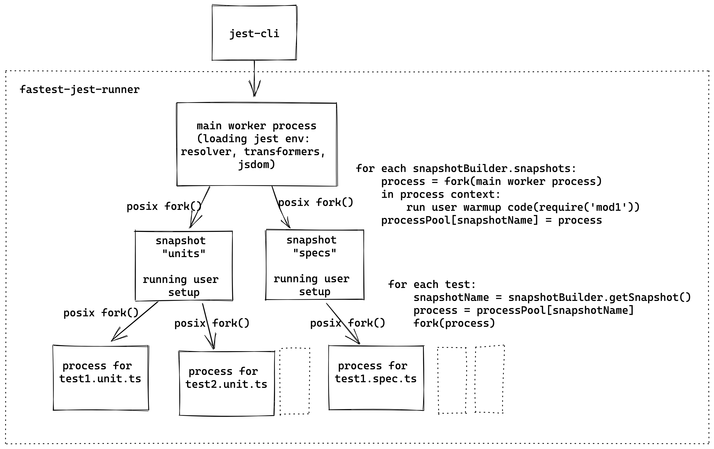

# fastest-jest-runner

### Motivation
From what I discovered, there are two major reasons of jest slowness, compared to jasmine e.g. 
1) for every test file jest is creating new env, importing all the modules, creating jsdom env etc
2) memory leaks, which have even more effect becauase of 1) reason.

With jest aproach:
- memory leaks could not be fixed conceptually (using vm.Context), because memory could be leaked through core modules and globals (e.g. console).
- first could not be speed up either, modules should be executed for every testfile, otherwise they will affect each other.

This runner:
- fixes memory leaks by design: every test is run in new, forked, process, which memory being copied from main process. Process then will end and exit, not affecting and share runtime with parent process.
- while modules execution problem is not "fixed", it could be improved a lot by creating custom "snapshots", which has imported modules and created objects which then will be used by all tests. Amount of "warmed up" memory does not affect fork time.

##### Tested only with jest 29

###How it works:
This runner is utilizing posix fork syscall.
Fork() is relatively cheap (~1ms), it clones (copy on write) all memory pages, file descriptors and current thread callstack of process.
Because nodejs does not support fork(), C++ extension is written and node is run in single thread mode (with some caveats with worker thread pool).

Every test is run in new process, created by fork() call.
Communication is set up by unix sockets.
Fork is called from one of "snapshot" processes, which has warmed up env: required/imported modules, jsdom, whatever user save in global.
If `snapshotBuilderPath` is not set, default snapshot builder is applied: by default it's only init jest test env (jsdom), test runner (jasmine or circus)

If you want best results - you will need to write custom snapshot builder.
Basically you can import all common modules, used by majority of tests.
You can even import all modules, it will only increase time of snapshot creation, not every test time.
But imported modules could not be mocked.
Last could be get arounded by marking tests with custom pragma and use empty snapshot for it (see advanced usage)

### Scheme:

### Setup:
1) `yarn add fastest-jest-runner`
2) write in `jest.config`: `"runner": "fastest-jest-runner"`

### Advanced usage:
[using custom snapshots](tests/e2e/snapshots/package.json)

### [Benchmarks](./test/benchmarks)

### Not working:
- custom jest runners, except jasmine2 and circus (can be impl)
- watch mode (can be impl)
- Windows OS
- jest snapshots (can be impl)
- mocking modules after require in custom snapshots
- worker threads, created in custom snapshot
